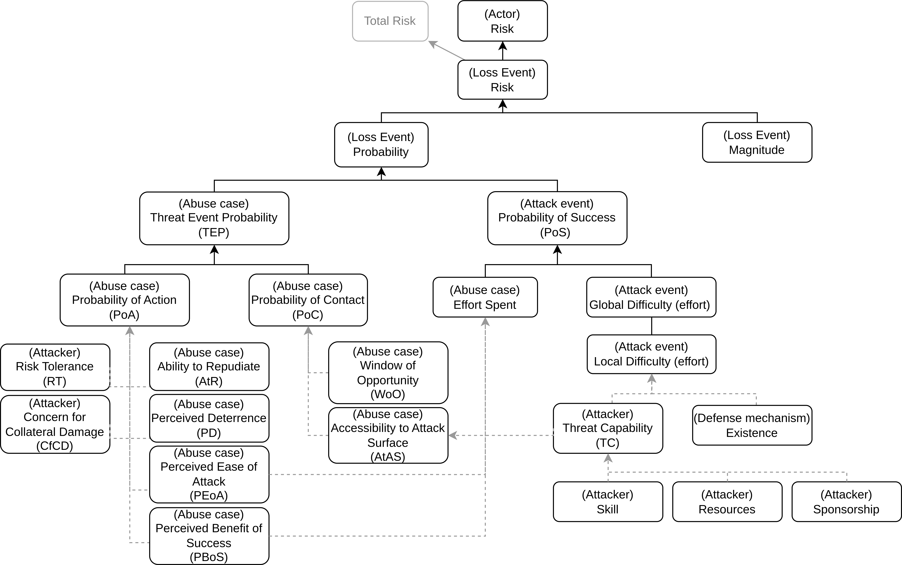
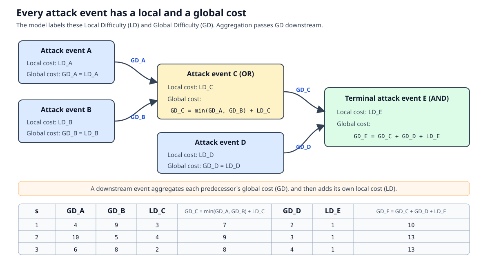
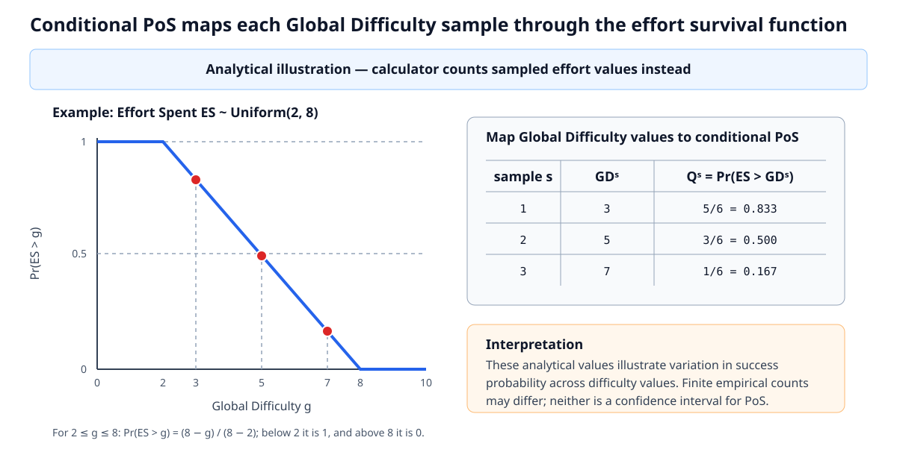
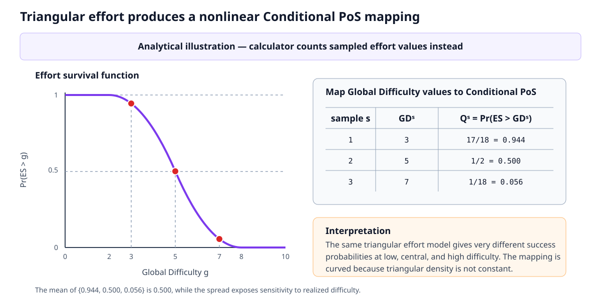

# Yacraf calculations and statistical extensions

This document explains the calculations implemented by the Yacraf calculator, including its statistical treatment of distribution-valued inputs. It complements the [Yacraf paper](https://link.springer.com/article/10.1007/s10207-023-00713-y). For installation, input syntax, settings, and GUI instructions, see the [Yacraf calculator user guide](../../YACRAF-Calculator-Tool/README.md).

The calculator supports both the paper-compatible single-value workflow and additional statistical functionality. These have different theoretical status and must not be reported as though they were the same method.

## Contents

1. [Status of the calculations](#status-of-the-calculations)
2. [Notation](#notation)
3. [Bundled Yacraf input calculations](#bundled-yacraf-input-calculations)
4. [Distribution-valued inputs](#distribution-valued-inputs)
5. [Empirical Monte Carlo propagation](#empirical-monte-carlo-propagation)
6. [Global Attack Difficulty](#global-attack-difficulty)
7. [Threat Event Probability, Loss Probability, and Loss Risk](#threat-event-probability-loss-probability-and-loss-risk)
8. [Probability of Success modes](#probability-of-success-modes)
9. [Results, percentiles, and repeated runs](#results-percentiles-and-repeated-runs)
10. [How the bundled metamodel implements the calculations](#how-the-bundled-metamodel-implements-the-calculations)

## Status of the calculations

| Calculation or behavior | Status | Interpretation |
| --- | --- | --- |
| Bundled Yacraf metamodel, including $TEP=PoC\cdot PoA$, the single-value PoS result, $LR=LM\cdot LP$, and actor-risk aggregation | **Paper-compatible behavior** | Implements the ordinary Yacraf calculation chain represented by the bundled metamodel. |
| Empirical Monte Carlo propagation and attack-plan-aware Global Difficulty aggregation | **Calculator statistical implementation** | Propagates distribution-valued inputs without fitting an output distribution family. This is the calculator's numerical implementation for uncertain inputs. |
| Independent union of several abuse-case contributions to one loss | **Explicit calculator assumption** | Assumes the separate loss causes are independent and not mutually exclusive. Dependence or mutual exclusivity must be modeled manually. |
| Conditional PoS distribution | **Optional theoretical extension** | Returns a distribution of success probabilities conditional on realized Global Difficulty. It is not the single-value PoS calculation described in the Yacraf paper. |

## Notation

| Symbol | Meaning |
| --- | --- |
| $AtAS$ | Accessibility to Attack Surface |
| $WoO$ | Window of Opportunity |
| $AtR$ | Ability to Repudiate |
| $PD$ | Perceived Deterrence |
| $PEoA$ | Perceived Ease of Attack |
| $PBoS$ | Perceived Benefit of Success |
| $RT$ | Risk Tolerance |
| $CfCD$ | Concern for Collateral Damage |
| $Sk$ | Attacker Skill |
| $Res$ | Attacker Resources |
| $Sp$ | Attacker Sponsorship |
| $TC$ | Threat Capability |
| $LD$ | Local Difficulty: the incremental difficulty of one attack event |
| $GD$ | Global Difficulty: the total difficulty of the easiest complete plan reaching an attack event |
| $ES$ | Effort Spent by the attacker |
| $PoC$ | Probability of Contact |
| $PoA$ | Probability of Action |
| $TEP$ | Threat Event Probability |
| $PoS$ | Probability of Success, conditional on an attack being attempted |
| $LM$ | Loss Magnitude |
| $LP$ | Loss Probability |
| $LR$ | Loss Risk |
| $AR$ | Actor Risk |
| $DMI$ | Defense Mechanism Impact: difficulty added by a connected defense |
| $DMC$ | Defense Mechanism Cost: a separate decision input |
| $DME$ | Defense Mechanism Existence: a conceptual factor in the framework figure, not a stored calculator attribute |
| $N$ | Number of Monte Carlo samples |
| $s,t$ | Monte Carlo sample indices |

All difficulty and effort quantities compared in the calculations must use compatible units and refer to the same attacker, attack opportunity, and time horizon.

## Bundled Yacraf input calculations

The bundled metamodel uses values from $0$ to $10$ for the contributing attacker and abuse-case assessments. Threat Capability is the arithmetic mean of attacker Skill, Resources, and Sponsorship:

$$
TC=\frac{Sk+Res+Sp}{3}.
$$

Probability of Contact is the mean of Accessibility to Attack Surface and Window of Opportunity, scaled from $0$–$10$ to $0$–$1$:

$$
PoC=0.1\cdot\frac{AtAS+WoO}{2}.
$$

Probability of Action combines positively formulated inputs directly and reverses negatively formulated inputs with $10-x$ before taking and scaling the mean:

$$
PoA
=0.1\cdot\frac{
PEoA+PBoS+RT+(10-AtR)+(10-PD)+(10-CfCD)
}{6}.
$$

Threat Event Probability is then

$$
TEP=PoC\cdot PoA.
$$

The dotted or qualitative relationships in the framework are prompts for analyst judgment, not additional numerical formulas. In particular, the bundled metamodel calculates $TC$ but leaves Effort Spent and Local Difficulty as manual assessments informed by the connected qualitative factors. Likewise, the model can use $TC$ to highlight relevant considerations without automatically converting it into $LD$, $AtAS$, or $ES$.

## Distribution-valued inputs

The calculator accepts a fixed non-negative value or a non-negative uniform, triangular, zero-truncated normal, lognormal, or exponential distribution. A deterministic non-negative shift may also be added to a named distribution. The parameterizations are:

- uniform: minimum and maximum;
- triangular: minimum, mode, and maximum;
- zero-truncated normal: arithmetic mean and standard deviation before truncation at zero;
- lognormal: median and geometric standard deviation; and
- exponential: mean, equivalently its scale.

For a shifted input, let $X$ follow the named distribution and let $c\geq0$ be the stated offset. Each resulting sample is

$$
Y^{(s)}=c+X^{(s)}.
$$

For example, `1 + lognormal / 5 / 2` uses a lognormal distribution with median $5$ and geometric standard deviation $2$, then adds $1$ to every sampled value. The shifted distribution therefore has lower bound $1$ and median $6$. The offset is deterministic, not another uncertain input.

These names describe the input distributions only. The calculator does not force a named distribution family on an aggregated result.

In the bundled metamodel, named distributions are accepted for attack-event Local and Global Difficulty and their hidden intermediate values, abuse-case Effort Spent, Loss Magnitude and Loss Risk, Actor Risk, and Defense Mechanism Cost and Impact. Probability of Contact, Probability of Action, and Threat Event Probability remain scalar probability inputs or results. Probability of Success and Loss Probability can nevertheless become empirical distributions when Conditional PoS mode produces distribution-valued downstream results. A custom metamodel may assign the sampled-distribution value type to additional fields.

## Empirical Monte Carlo propagation

For each calculation run, the calculator draws $N$ values from every manually entered distribution:

$$
x_j^{(s)} \sim X_j, \qquad s=1,\ldots,N.
$$

It then evaluates the complete model for sample index $s$, producing $y^{(1)},\ldots,y^{(N)}$. This sample vector is the empirical output distribution. Displayed quantiles and plots are calculated directly from these empirical samples; the calculator does not assume that the output is normal, triangular, or any other named family and does not fit such a family after aggregation.

A fixed input such as $2$ is expanded to $2$ in every sample. Arithmetic involving a distribution and a scalar broadcasts the scalar across all $N$ samples, while arithmetic involving distributions is performed on aligned sample indices.

Different manually entered sources are sampled independently. When the same local attack event is reused through several graph branches or linked views, its samples are cached for that calculation run and reused consistently. This prevents the same uncertain source from receiving unrelated realizations merely because it occurs in more than one branch.

The Monte Carlo sample count controls numerical resolution rather than model uncertainty. More samples normally make quantiles and probability estimates more stable, but they do not remove uncertainty represented by the input distributions.

## Global Attack Difficulty

Every attack event—including root, intermediate, AND, OR, and terminal events—has both a Local Difficulty ($LD$) and a Global Difficulty ($GD$). Local Difficulty is the incremental cost of performing the event itself. Global Difficulty is the total cost of the easiest complete attack plan that reaches and performs it, including the impact of connected defenses.

Consequently, a root attack event without a connected defense has $GD=LD$. A downstream attack event aggregates its predecessors' **global** difficulties and then adds its own Local Difficulty and connected Defense Mechanism Impact. It does not aggregate the predecessors' Local Difficulties directly.

Let $c_r^{(s)}$ be the sampled difficulty contribution of one atomic source $r$. An atomic source can be an attack event's Local Difficulty or a connected Defense Mechanism Impact. A complete feasible attack plan $p$ is represented as a set of required atomic sources. Its total difficulty in sample $s$ is

$$
GD_{a,p}^{(s)} = \sum_{r \in p} c_r^{(s)}.
$$

If $\mathcal{P}_a$ is the set of feasible plans that reach attack event $a$, the event's Global Difficulty sample is

$$
GD_a^{(s)} = \min_{p \in \mathcal{P}_a} GD_{a,p}^{(s)}.
$$

The gate operations construct the feasible plans as follows:

1. `OR` collects the alternative input plans. The easiest alternative may be different in different Monte Carlo samples.
2. `AND` forms every required combination and uses set union on the atomic sources. A Local Difficulty or Defense Mechanism Impact shared by two branches is therefore charged once rather than twice.
3. Plans that are strict supersets of another feasible plan are discarded. This is valid because the supported difficulty contributions are non-negative, so a strict superset cannot be easier.

The result at every attack event is therefore the empirical distribution of the easiest complete plan reaching that event—not a sum or minimum calculated from only the three displayed percentiles.

Defense Mechanism Cost ($DMC$) is a separate input for comparing or prioritizing defenses. It is not added to Global Difficulty and does not automatically propagate into Loss Probability, Loss Risk, or Actor Risk. Defense Mechanism Impact ($DMI$), by contrast, is added directly to the attack plan when the defense is connected. The framework's Defense Mechanism Existence ($DME$) is not implemented as a separate calculator attribute; disabling a defense is modeled by overriding its Impact to zero, as done by the bundled `Disable Defenses` script.

The bundled metamodel uses identity transformations between connected Global Difficulty attributes. A custom metamodel should keep those attribute-input scalars at $1$ and offsets at $0$ for attack-difficulty aggregation. Applying an affine transformation to an already aggregated plan is numerically supported, but it discards atomic-plan provenance; a later gate can then no longer detect and remove duplicated shared prerequisites.

## Threat Event Probability, Loss Probability, and Loss Risk

The bundled metamodel separates the probability that an attack is initiated from the probability that an initiated attack succeeds:

$$
TEP = PoC \cdot PoA.
$$

Probability of Action therefore does **not** alter an attack event's PoS. PoS answers the conditional question: given this Effort Spent and Global Difficulty, what is the probability that the attempted attack succeeds? The abuse-case probabilities enter the Loss Probability calculation instead.

### One abuse case contributing to a loss

For every abuse case $j$ that can cause a loss, the calculator pairs its Threat Event Probability with the PoS of its terminal attack event and calculates one loss-cause contribution:

$$
p_j = TEP_j \cdot \mathrm{PoS}_{j,\mathrm{terminal}}.
$$

With one abuse case, this directly gives

$$
LP=TEP\cdot\mathrm{PoS}_{\mathrm{terminal}},
\qquad
LR=LM\cdot LP.
$$

### Several abuse cases contributing to the same loss

The calculator assumes that separate abuse-case contributions are independent and not mutually exclusive. Under that assumption, the Loss Probability is their probability union:

$$
LP
= \Pr\!\left(\bigcup_j L_j\right)
= 1-\prod_j(1-p_j),
\qquad
LR = LM \cdot LP.
$$

For example, with two contributions $p_1=0.10$ and $p_2=0.12$,

$$
LP=1-(1-0.10)(1-0.12)=0.208.
$$

The result is neither the simple sum $0.22$ nor the product $0.012$.

System-view connections are direct, not transitive. For each contribution, connect the abuse case and its terminal attack event directly to the loss. The calculator associates them by following the attack graph from that abuse case to the terminal event. Every connected abuse case must lead to exactly one of the loss's connected terminal attack events, and every connected terminal event must be associated with at least one abuse case. Several abuse cases may legitimately lead to the same terminal event. Ambiguous or unmatched connections produce a setup warning instead of silently multiplying unrelated inputs.

For compatibility with older saves, exactly one connected abuse case and one connected terminal event are paired even when the saved attack graph does not expose their dependency. New models should not rely on this fallback: represent the path explicitly so that the association remains unambiguous when the model grows.

If the abuse cases are mutually exclusive, dependent, or otherwise require a different overlap model, the independent-union formula is not valid. Calculate the appropriate combined probability separately, override $LP$ manually—for example through a script—and document the chosen dependence assumption.

In `Single success ratio` mode, the $p_j$ values and $LP$ are scalar. A distribution-valued Loss Magnitude still produces a distribution-valued Loss Risk:

$$
LR^{(s)}=LM^{(s)}LP.
$$

In Conditional PoS mode, the union and Loss Risk are evaluated sample by sample:

$$
LP^{(s)}=1-\prod_j\left(1-TEP_j\,Q_j^{(s)}\right),
\qquad
LR^{(s)}=LM^{(s)}LP^{(s)}.
$$

For an actor associated with loss events $k$, the bundled metamodel aggregates Actor Risk by addition:

$$
AR=\sum_k LR_k.
$$

When any $LR_k$ is distribution-valued, this sum is evaluated on aligned sample indices. The analyst remains responsible for defining loss events so that adding their risks is meaningful; overlapping descriptions of the same consequence can otherwise double-count risk.

The gray Total Risk box in the framework figure is conceptual. The bundled calculator aggregates Loss Risk into Actor Risk but does not automatically combine several actors into one additional Total Risk attribute.

## Probability of Success modes

### Single success ratio: paper-compatible mode

Let $ES^{(s)}$ be a sampled Effort Spent value and $GD_a^{(s)}$ the sampled Global Difficulty of attack event $a$. `Single success ratio` reports one scalar:

$$
\widehat{\mathrm{PoS}}_a
= \frac{1}{N}\sum_{s=1}^{N}
\mathbf{1}\!\left[ES^{(s)} > GD_a^{(s)}\right].
$$

Every aligned pair is one simulated attack situation. It contributes $1$ when effort is strictly greater than difficulty and $0$ otherwise. The result is the fraction of successful situations and estimates $\Pr(ES>GD_a)$. Equality counts as failure. This is the default mode because it returns the single probability used by the paper-compatible workflow.

### Conditional PoS distribution: optional theoretical extension

> **Important:** `Conditional PoS distribution` is an optional extension implemented by the calculator. It is not the single-value PoS calculation described in the Yacraf paper. A result produced in this mode must be labeled as a Conditional PoS distribution, with the calculation mode and sample count reported.

#### Motivation

The scalar ratio integrates over all uncertainty in Global Difficulty and returns one number. That is often exactly what is needed for expected risk, but it hides whether success is nearly constant or changes substantially between low- and high-difficulty realizations. Conditional mode retains this variation.

For example, suppose $ES\sim\mathrm{Uniform}(0,10)$ and each of the following two Global Difficulty values is equally likely. Both scenarios have mean Conditional PoS $0.50$, and therefore the same scalar PoS in the large-sample limit:

| Scenario | Possible $GD$ values | Conditional PoS values $Q(g)=\Pr(ES>g)$ | What the scalar hides |
| --- | --- | --- | --- |
| Nearly constant difficulty | $4.9,\ 5.1$ | $0.51,\ 0.49$ | Success stays close to 50% for either realization. |
| Strongly varying difficulty | $1,\ 9$ | $0.90,\ 0.10$ | Success changes from very likely to very unlikely. |

Thus a scalar value of $0.50$ cannot distinguish the narrow distribution $\{0.49,0.51\}$ from the wide distribution $\{0.10,0.90\}$. The Conditional PoS output makes that difference visible while preserving the same mean.

#### Definition and empirical calculation

Let $F_{ES}(g)=\Pr(ES\leq g)$ be the cumulative distribution function of Effort Spent and $S_{ES}(g)=1-F_{ES}(g)$ its survival function. For every sampled Global Difficulty $GD_a^{(s)}=g_s$, conditional mode defines

$$
Q_a^{(s)} = \Pr(ES>g_s) = S_{ES}(g_s)=1-F_{ES}(g_s).
$$

Because the implementation has effort samples rather than an analytic cumulative distribution function, it uses the empirical survival function:

$$
Q_a^{(s)}
= \widehat S_{ES}\!\left(GD_a^{(s)}\right)
= \frac{1}{N}\sum_{t=1}^{N}
\mathbf{1}\!\left[ES^{(t)} > GD_a^{(s)}\right].
$$

The separate indices are important. For each difficulty sample $s$, the calculator compares that difficulty with **all** effort samples $t$. Sorting the effort samples makes this calculation efficient. The output $Q_a^{(1)},\ldots,Q_a^{(N)}$ is retained as an empirical probability distribution and can be summarized or plotted.

#### Interpretation and relationship to the scalar result

| Mode | Returned object | Question answered |
| --- | --- | --- |
| `Single success ratio` | One number $\widehat{\Pr}(ES>GD_a)$ | Across all simulated effort-and-difficulty pairs, what fraction succeeds? |
| `Conditional PoS distribution` | Samples $Q_a^{(s)}$ in $[0,1]$ | How does the chance of success vary over plausible realized Global Difficulty values? |

The conditional output is **not** a posterior distribution or confidence interval for one unknown PoS, and it is not a vector of Bernoulli success/failure outcomes. Its percentiles describe variation in $\Pr(ES>g)$ caused by uncertain $g$. They do not quantify estimation confidence; increasing $N$ only makes the empirical approximation smoother and more stable.

Conditional mode treats Effort Spent $ES$ and Global Difficulty $GD_a$ as independent. Under this assumption,

$$
\mathbb{E}_{GD_a}\!\left[\Pr(ES>GD_a\mid GD_a)\right]
= \Pr(ES>GD_a),
$$

so the mean of the Conditional PoS samples should approach the scalar PoS as the sample count grows. Their medians and other percentiles need not equal the scalar probability.

If effort and difficulty are dependent—for example, if better-resourced attackers systematically choose harder routes—the correct quantity requires a joint model such as $\Pr(ES>g\mid GD_a=g)$. The current calculator does not model that dependence.

#### Survival-function mappings for the supported distributions

The implementation always evaluates the empirical survival function, so it does not need the following closed-form expressions. They clarify the theoretical mapping for a Global Difficulty realization $g$.

**Fixed effort.** For deterministic effort $ES=e$, strict comparison produces a step: $Q(g)=1$ when $g<e$ and $Q(g)=0$ when $g\geq e$.

**Shifted distributions.** If $ES=c+X$ for a non-negative fixed shift $c$, then

| Global Difficulty $g$ | Conditional PoS $Q(g)$ |
| --- | --- |
| $g<c$ | $1$ |
| $g\geq c$ | $S_X(g-c)$ |

Thus the survival function for any supported named distribution can be shifted by evaluating its unshifted survival function at $g-c$.

**Uniform.** For $ES\sim\mathrm{Uniform}(a,b)$, $Q(g)=1$ below $a$, $Q(g)=0$ at or above $b$, and

$$
Q(g)=\frac{b-g}{b-a}, \qquad a\leq g < b.
$$

When $a=b$, treat the uniform input as deterministic effort at $a$ rather than evaluating the fraction with a zero denominator.

**Triangular.** For $ES\sim\mathrm{Triangular}(a,m,b)$, where $m$ is the mode:

| Global Difficulty $g$ | Conditional PoS $Q(g)$ |
| --- | --- |
| $g<a$ | $1$ |
| $a\leq g\leq m$ | $1-\frac{(g-a)^2}{(b-a)(m-a)}$ |
| $m<g<b$ | $\frac{(b-g)^2}{(b-a)(b-m)}$ |
| $g\geq b$ | $0$ |

If the mode equals an endpoint or all three parameters are equal, interpret the expression by its corresponding limiting or deterministic case.

For a concrete example, let $ES\sim\mathrm{Triangular}(2,5,8)$ and suppose three sampled Global Difficulty values are $3$, $5$, and $7$:

| Sampled $g$ | Calculation | Conditional PoS $Q(g)$ |
| --- | --- | --- |
| $3$ | $1-(3-2)^2/((8-2)(5-2))$ | $17/18\approx0.944$ |
| $5$ | $1-(5-2)^2/((8-2)(5-2))$ | $1/2=0.500$ |
| $7$ | $(8-7)^2/((8-2)(8-5))$ | $1/18\approx0.056$ |

The resulting empirical Conditional PoS distribution is therefore approximately $\{0.944,0.500,0.056\}$. The following figure shows that nonlinear mapping.

**Zero-truncated normal.** For the calculator's $ES\sim\mathrm{Normal}(\mu,\sigma^2)\mid ES\geq0$, with standard normal cumulative distribution function $\Phi$, $Q(g)=1$ for $g<0$, and for $g\geq0$,

$$
Q(g)=\frac{1-\Phi\!\left((g-\mu)/\sigma\right)}{1-\Phi\!\left(-\mu/\sigma\right)}.
$$

When $\sigma=0$, effort is deterministic and the mapping is a step at $\mu$.

**Lognormal.** For $ES\sim\mathrm{Lognormal}(\log m,\log^2 g_{\mathrm{sd}})$, where $m$ is the median and $g_{\mathrm{sd}}$ is the geometric standard deviation, $Q(g)=1$ for $g\leq0$, and

$$
Q(g)=1-\Phi\!\left(\frac{\log g-\log m}{\log g_{\mathrm{sd}}}\right), \qquad g>0.
$$

When $g_{\mathrm{sd}}=1$, effort is deterministic at the median.

**Exponential.** For $ES\sim\mathrm{Exponential}(\theta)$, where the mean (scale) $\theta>0$, $Q(g)=1$ for $g<0$, and

$$
Q(g)=e^{-g/\theta}, \qquad g\geq0.
$$

The strict comparison $ES>g$ is used in every case. Equality has probability zero for continuous distributions, but the distinction matters for deterministic or repeated empirical values.

#### Appropriate use and reporting

Use `Single success ratio` when a single paper-compatible PoS is required. Use Conditional PoS when variation in success probability across uncertain Global Difficulty is itself useful for sensitivity analysis, communication, or downstream distribution-valued risk.

When reporting Conditional PoS, include:

- the Effort Spent distribution and all Local Difficulty distributions;
- the Monte Carlo sample count;
- the Effort Spent–Global Difficulty independence assumption;
- the displayed percentiles; and
- both the mean, for comparison with scalar PoS, and the plotted empirical distribution where practical.

## Results, percentiles, and repeated runs

Each press of `Calculate` clears the per-run sample cache and draws new samples from every manually declared distribution. A reused source keeps the same samples everywhere within that one run, but a later run draws a new realization. The calculator currently has no user-facing random-seed setting. Small differences between repeated results are therefore expected, especially at low sample counts or in distribution tails.

Calculated sample arrays are not stored in save files; the selected sample count, percentile mode, and PoS mode are stored. Reopening and recalculating a save regenerates its empirical distributions.

The two display modes summarize empirical samples as follows:

- `P0 / P50 / P100` shows the smallest observed sample, median, and largest observed sample. `P0` and `P100` are sample extrema, not necessarily the theoretical lower and upper bounds of the underlying distribution.
- `P5 / P50 / P95` shows the empirical 5th percentile, median, and 95th percentile. It suppresses the most extreme 5% of sampled values in each tail from the displayed interval but does not remove them from the underlying sample vector.

The selection changes only the three displayed values and percentile markers. It does not change sampling, downstream calculations, or the full empirical histogram and cumulative distribution available through `Plot distribution`.

An explicit attribute override, normally applied through a custom script, takes precedence over the bundled calculation for that attribute. Downstream calculations then consume the overridden value. A reported result that uses an override must identify it, because the overridden attribute no longer follows the equation documented here.

## How the bundled metamodel implements the calculations

The bundled Metamodel Views encode Yacraf and are expected to remain unchanged during ordinary use. Their Input blocks implement the transformations and relationships consumed by the calculations above.

The metamodel editor exposes the following generic operations:

| Symbol | Operation | Behavior |
| --- | --- | --- |
| `M` | Mean | Arithmetic mean of all inputs; distribution-valued inputs are averaged sample by sample. |
| `&` | AND/addition | Sum of all inputs. For attack-plan-aware values it combines all required atomic sources and counts a shared source once. |
| `\|` | OR/minimum | Minimum of the inputs. For attack-plan-aware values it retains the alternative plans so the easiest plan can vary by sample. |
| `*` | Multiplication | Product of all inputs, evaluated sample by sample when needed. The bundled Loss Probability attribute specializes this operation by pairing loss causes and taking their independent probability union. |
| `/` | Division | Exactly two ordered inputs, calculated as input (1) divided by input (2), sample by sample when needed. |
| `T` | Effort comparison | Exactly two ordered inputs: Effort Spent (1) and Global Difficulty (2). It applies the selected PoS mode using the strict comparison $ES>GD$. |
| `Q` | Qualitative | No numerical operation. The output remains a manual assessment while the connections document and highlight relevant considerations. |

After an operation, the destination attribute applies its Metamodel Input scalar and offset:

$$
y_{\mathrm{adjusted}}=\alpha y+\beta.
$$

The destination value type then enforces its range. Sampled-distribution results are clipped to be non-negative, and probability results are clipped to $[0,1]$. These are metamodel attribute settings; System View connections pass values without an editable scalar or offset.

The attributes highlighted by (1) in the following figure accept values between 0 and 10. The shown addition, multiplication by $-1$, and offset $10$ feed a temporary hidden attribute and reverse a negatively formulated scale into a positive one, or vice versa. Algebraically, the transformation is

$$
x \longmapsto 10-x.
$$

For example, it transforms $3$ into $7$.

Calculation type `Q`, highlighted by (2), illustrates the qualitative operation described in the table. Its connections visualize the relationship and allow relevant inputs to be highlighted in the System View.

For GUI instructions and the advanced metamodel editor, return to the [Yacraf calculator user guide](../../YACRAF-Calculator-Tool/README.md). Source-level implementation notes are available in the [calculation code overview](../../YACRAF-Calculator-Tool/src/blocks_calculation/README.md).
