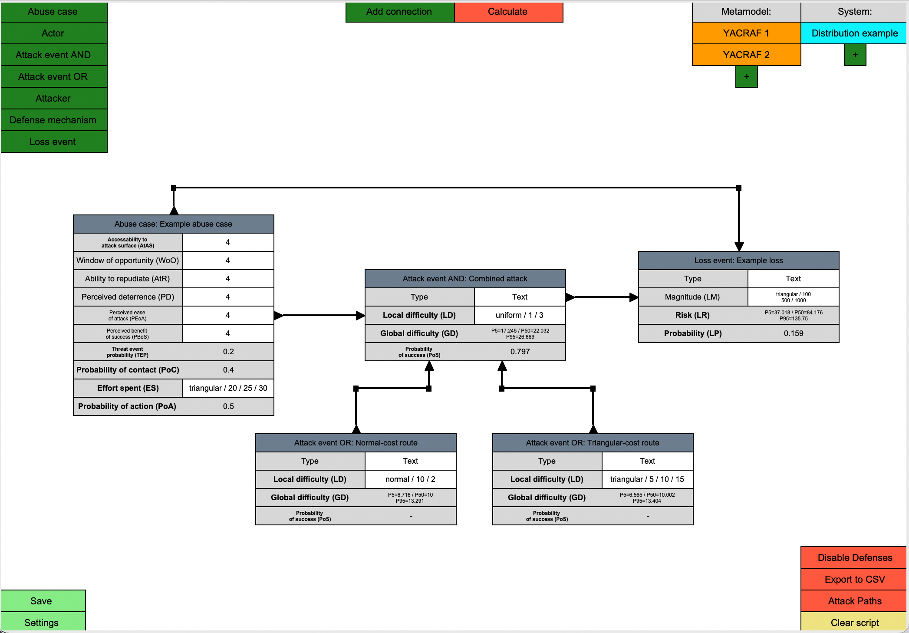

# Yacraf calculator

## Background
This is a graphical tool for doing calculations according to [Yacraf](https://link.springer.com/article/10.1007/s10207-023-00713-y) used in the KTH courses EP2790, EP2791, and EP279V.

This tool allows calculations inherent to the threat modeling to be set up and calculated using graphical block diagrams, where one can place, drag, and connect different blocks across various `Views`. The tool aims to allow for (i) the automation of the calculation process, where any changes to any block automatically propagate through the system and (ii) the simulation/analysis of various system configurations.

This README explains how to install and operate the calculator. In addition, we provide a set of short tutorial videos that walk you through the tool, from setup and basic navigation to running example workflows with Yacraf. **Note! The videos are recorded in an earlier tool version, so while details may be legacy the overall design remains the same.**
- Video 1 - [First launch & pre-installed models](https://play.kth.se/media/YACRAF-tool-1/0_of3nc0sc)
- Video 2 - [Workspace creation](https://play.kth.se/media/YACRAF-tool-2/0_mtn010dp)
- Video 3 - [Creating attacker profiles & abuse cases](https://play.kth.se/media/YACRAF-tool-3/0_mkt2fuhc)
- Video 4 - [Creating attack trees](https://play.kth.se/media/YACRAF-tool-4/0_yc4z3d9j)
- Video 5 - [Metamodel editing](https://play.kth.se/media/YACRAF-tool-5/0_wa27pt27)

Parameter definitions, equations, statistical assumptions are maintained in the course material's [Yacraf calculations and statistical extensions](../Course-material/lectures/Yacraf-calculations.md).

> **Use the bundled metamodel as-is.** It is the calculator's implementation of the Yacraf metamodel. Normal use consists of adding instances, values, and connections in `System Views`; changing the `Metamodel Views` is neither expected nor required. Metamodel editing is documented only for maintainers and advanced experiments in [Advanced: changing or rebuilding the Yacraf metamodel](#advanced-changing-or-rebuilding-the-yacraf-metamodel) at the end of this README. The calculation reference clearly distinguishes paper-compatible behavior from calculator-specific statistical assumptions and the optional `Conditional PoS distribution` extension.

**Disclaimer**: The Yacraf calculator is prototype software. It was not developed as a commercial product fulfilling all the requirements that would come with that, but as a best-effort prototype for education and research. It is intended to assist practical use of Yacraf, but is by no means the only way to do Yacraf-based risk analysis. The code may contain bugs, so using it is at your own risk and all results need to be cross-checked. Known bugs are reported under Issues. Any help with improving any dimension of the tool is most welcome—looking forward to your pull request! :)

Having all that said, we hope you find the tool useful.

# Table of Contents

1. [Dependencies](#dependencies)
2. [Running the Yacraf Calculator](#running-the-yacraf-calculator)
3. [Features in this version](#features-in-this-version)
4. [GUI Overview](#gui-overview)
   - [Parameter notation](#parameter-notation)
   - [View Switching](#views-switching)
   - [Working with System Views](#working-with-system-views)
     - [Adding Class Instances](#adding-class-instances)
     - [Adding Connections](#adding-connections)
     - [Calculating Values](#calculating-values)
5. [Using distribution-valued parameters](#using-distribution-valued-parameters)
   - [Declaring input distributions](#declaring-input-distributions)
   - [Settings](#distribution-calculation-settings)
   - [Plotting distributions](#plotting-distributions)
6. [Calculation theory and statistical assumptions](../Course-material/lectures/Yacraf-calculations.md)
7. [Scripts and Customization](#scripts-and-customization)
8. [Error Handling](#error-handling)
9. [Step-by-Step Video Walkthroughs](#step-by-step-video-walkthroughs)
10. [Reporting bugs with the Yacraf tool](#reporting-bugs-with-the-yacraf-tool)
11. [Contribute to Yacraf](#contribute-to-yacraf)
12. [FAQ](#faq)
13. [Advanced: changing or rebuilding the Yacraf metamodel](#advanced-changing-or-rebuilding-the-yacraf-metamodel)


## Dependencies

The program utilizes Tkinter for its GUI, NumPy for its calculations, and Matplotlib for distribution plots. If not already installed, Tkinter can on Debian-based Linux distributions (such as Ubuntu) be installed using:

```
sudo apt install python3-tk
```

The Python dependencies can be installed using:

```
pip install -r requirements.txt
```

Make sure the Python installation is not outdated. The known minimum requirement is Python 3.7, where 3.10 was used during the program's development. You may also need to update NumPy if you get an error related to it when booting the program.

## Running the Yacraf calculator

After navigating to the main directory, run the program using:

```
python3 main.py
```

This opens `example_distribution`, a small distribution-valued attack graph described below. To open or create a different save, specify its name:

```
python3 main.py <save_name>
```

Specifying a save name that does not currently exist creates a completely new save. To list the existing saves without opening the GUI, run `python3 main.py --list`.

The default saves of the program contain examples of the Yacraf metamodel, including accompanying system-model examples. The following default saves exist:

1. `example_distribution`: The default startup example. Two alternative attack events with `normal / 10 / 2` and `triangular / 5 / 10 / 15` local difficulty feed an AND event with `uniform / 1 / 3` local difficulty. An abuse case supplies `triangular / 20 / 25 / 30` effort, and the terminal event feeds a loss with `triangular / 100 / 500 / 1000` magnitude. The loss also receives the abuse case directly so its probability includes both threat-event probability and terminal PoS.
2. `example_single`: Example based on the illustrative example found in Section 4 of the Yacraf paper, where the Yacraf metamodel is defined in the corresponding `Metamodel Views`, and the calculations are performed in the `System Views`.
3. `example_triangle`: Same as `example_single`, except using triangle distributions whenever applicable.
4. `Cloud`: A small example of a threat model for a cloud service provider, adapted from this [example](https://www.nccgroup.com/research-blog/threat-modelling-cloud-platform-services-by-example-google-cloud-storage/) and represented using the Yacraf metamodel.
5. `custom`: Same `Metamodel Views` as `example_triangle`, but with blank `System Views` to simplify the creation of a new threat model for a different system using the Yacraf metamodel.

## Features in this version

This version retains the original scalar Yacraf workflow and adds distribution-valued analysis. The additions are summarized here; their mathematical definitions and assumptions are documented in [Yacraf calculations and statistical extensions](../Course-material/lectures/Yacraf-calculations.md).

| Feature | What the end user can do |
| --- | --- |
| [Named input distributions](../Course-material/lectures/Yacraf-calculations.md#distribution-valued-inputs) | Use uniform, triangular, non-negative normal, lognormal, or exponential distributions for local attack difficulty, abuse-case effort, loss magnitude, loss risk, and aggregated actor risk. |
| [Empirical Monte Carlo propagation](../Course-material/lectures/Yacraf-calculations.md#empirical-monte-carlo-propagation) | Calculate every downstream distribution from samples of the declared inputs instead of forcing an analytically fitted output family. |
| [Attack-plan-aware cost aggregation](../Course-material/lectures/Yacraf-calculations.md#global-attack-difficulty) | Evaluate OR alternatives per sample, combine AND requirements, and count a shared prerequisite only once. |
| Configurable sample count | Choose the number of Monte Carlo samples in `Settings`. |
| Configurable result summaries | Display either `P0 / P50 / P100` or `P5 / P50 / P95` in calculated distribution fields. |
| [Two attack-event PoS modes](../Course-material/lectures/Yacraf-calculations.md#probability-of-success-modes) | Retain the paper-compatible scalar success ratio or opt into a distribution of success probabilities conditional on uncertain global difficulty. |
| [Distribution-valued losses](../Course-material/lectures/Yacraf-calculations.md#threat-event-probability-loss-probability-and-loss-risk) | Give loss magnitude a distribution and propagate scalar or distribution-valued probability into loss risk. |
| [Multiple loss causes](../Course-material/lectures/Yacraf-calculations.md#several-abuse-cases-contributing-to-the-same-loss) | Combine independent, non-mutually-exclusive abuse-case contributions as a probability union. |
| Full distribution plots | Plot an empirical density histogram and cumulative distribution for any distribution-valued parameter on any object, whether manually entered or calculated. |
| Default worked example | Start directly in `example_distribution`, a five-node example connecting an abuse case, alternative attack steps, a terminal step, and a loss event. |
| Compatibility and diagnostics | Load legacy three-number triangular values, avoid storing thousands of calculated samples in save files, and report invalid distribution/configuration inputs with calculation-specific warnings. |

The distribution features require NumPy for sampling and Matplotlib for plots. General settings are stored with the save and take effect on the next calculation.


## GUI Overview

The graphical interface contains `System Views` (`Setup Views`) for building the analyzed scenario and `Metamodel Views` (`Configuration Views`) containing the bundled Yacraf definition. End users normally work only in `System Views`: add an abuse case, attack events, loss events, and other instances; enter their values; connect them; and calculate. The metamodel views may be inspected to understand dependencies, but editing them is an advanced maintenance activity documented at the end of this README.

### Parameter notation

Parenthesized abbreviations in model blocks identify the **meaning of a parameter**, not its internal value type. For example, `Local difficulty (LD)` and `Global difficulty (GD)` may both be distribution-valued, while `Probability of success (PoS)` may be either a scalar or an empirical distribution depending on the selected calculation mode. The notation follows the [Yacraf summary framework](../Course-material/lectures/Risk_calculator_framework.png). Abbreviations marked with an asterisk are added by this calculator for parameters that are named but not abbreviated in that figure.

| Object | Parameter abbreviations |
| --- | --- |
| Abuse case | Accessibility to Attack Surface (`AtAS`), Window of Opportunity (`WoO`), Ability to Repudiate (`AtR`), Perceived Deterrence (`PD`), Perceived Ease of Attack (`PEoA`), Perceived Benefit of Success (`PBoS`), Probability of Contact (`PoC`), Probability of Action (`PoA`), Threat Event Probability (`TEP`), Effort Spent (`ES`*) |
| Attacker | Risk Tolerance (`RT`), Concern for Collateral Damage (`CfCD`), Skill (`Sk`*), Resources (`Res`*), Sponsorship (`Sp`*), Threat Capability (`TC`) |
| Attack event | Local Difficulty (`LD`*), Global Difficulty (`GD`*), Probability of Success (`PoS`) |
| Loss event | Loss Magnitude (`LM`*), Loss Probability (`LP`*), Loss Risk (`LR`*) |
| Actor | Actor Risk (`AR`*) |
| Defense mechanism | Defense Mechanism Cost (`DMC`*), Defense Mechanism Impact (`DMI`*), Defense Mechanism Existence (`DME`*) |

Text fields and other parameters with no defined semantic abbreviation are shown without a parenthesized suffix. For a custom metamodel parameter, put any desired abbreviation in its name. Maintainers can still inspect or change the underlying value type in the advanced metamodel editor.


### Views Switching 

In the top right corner of the GUI are two columns of buttons - see (1) and (2) in the figure below. The figure shows a `Metamodel View`. These buttons switch between the different `Views`, where the left-most column switches between `Metamodel Views` and the right-most between `System Views`. The button with the `+` allows for an additional `View` to be added. The current `View` can be configured by pressing E (for edit) when no block inside the `View` is selected (will edit the block otherwise), whereas one for a `Metamodel View` can:

1. Change its name
2. Switch their button order
3. Delete it

For a `System View`, one can:

1. Change its name
2. Switch their button order
3. Create a copy of it
4. Temporarily exclude it from current calculations
5. Delete it

The save button in the bottom left corner ((3) in the below figure) saves the current state of all `Metamodel Views` and `System Views`, but also any changes to the general settings found by pressing the settings button. Any selected block within a `View` can be deleted by pressing backspace.


### Working with System Views

The figure below shows an example model (following the Yacraf metamodel) in the `System View` (upper right corner, marked blue). The green buttons in the upper left add class instances, `Add connection` and `Calculate` are at the top centre, and view navigation is in the upper right. `Save` and `Settings` are in the lower left, while the lower-right buttons run or clear custom scripts. Scripts are explained in detail later.



#### Adding Class Instances

An instance of a `Class` from a `Metamodel View` can be added to the current `System View` by pressing the corresponding green button in the upper left. The `Class` instances can be configured by pressing `E` when selected, where one can:

1. Change the name of the corresponding `Class` instance
2. Create a linked copy of the instance in another `System View` (any calculated value takes all linked versions into account). Linked copies are identified by a light-green marker in the instance's upper-right corner.


#### Adding Connections

Pressing `Add connection` creates a directional `Connection` with a triangle at each end. Drag the triangles to attach the connection to its source and destination class instances. The `Attributes` of the destination `Class` may then take input from the source `Class` if those `Attribute` relations have been configured in the `Metamodel Views`. Attaching a `Connection` to a `Class` automatically disables an `Attribute` entry field when its value depends on at least one connected `Class`.

System-view connections pass values unchanged and do not have editable scalar multipliers. Fixed transformations required by Yacraf are part of the bundled metamodel calculations.

#### Calculating Values

Pressing `Calculate` calculates every `Attribute` that does not have a manual input entry field, across all `Classes` in all `System Views`. In the example above, Global Difficulty (GD), Probability of Success (PoS), Loss Risk (LR), and Loss Probability (LP) are calculated downstream values. Distribution-valued results are shown using the percentile range selected in `Settings`. Selecting a calculated `Attribute` highlights the contributing input `Attributes` in orange. See [Yacraf calculations and statistical extensions](../Course-material/lectures/Yacraf-calculations.md) for the calculation sequence and interpretation of these results.

## Using distribution-valued parameters

### Declaring input distributions

A distribution-valued parameter can represent local difficulty, global difficulty, effort spent, loss magnitude, loss risk, aggregated actor risk, or another uncertain quantity in a custom model. It may be entered as either a single fixed non-negative value or a distribution name followed by its parameters:

```text
fixed value, for example: 2
uniform / minimum / maximum
triangular / minimum / mode / maximum
normal / mean / standard deviation
lognormal / median / geometric standard deviation
exponential / mean
```

This fixed-value form is accepted by every distribution-valued field on every object type. For example, entering `2` is the clearer deterministic equivalent of `uniform / 2 / 2`.

An optional non-negative location shift can precede any named distribution:

```text
offset + distribution / parameters
```

For example, `1 + lognormal / 5 / 2` adds a fixed offset of 1 to values generated from the stated lognormal distribution. The offset is not another sampled input and does not change the named distribution's parameters. See the [calculation reference](../Course-material/lectures/Yacraf-calculations.md#distribution-valued-inputs) for its statistical interpretation.

Other examples are `uniform / 2 / 5`, `triangular / 2 / 3 / 5`, `normal / 4 / 1`, `lognormal / 6 / 1.5`, and `exponential / 3`. All five represent non-negative quantities:

- `uniform` gives equal density between its minimum and maximum.
- `triangular` uses a minimum, most likely value (mode), and maximum.
- `normal` uses an arithmetic mean and standard deviation and is truncated at zero by rejection sampling.
- `lognormal` uses a median and geometric standard deviation; the geometric standard deviation must be at least 1.
- `exponential` uses one strictly positive mean, also known as its scale. Its rate is the reciprocal of that mean.

The offset must be finite and non-negative. For a shifted uniform or triangular distribution, the resulting lower bound is the offset plus the distribution's stated minimum. Normal inputs remain truncated at zero before the offset is added.

Select a manually entered distribution-valued parameter and press `E` to choose a template in the GUI. The inserted template remains editable. Legacy three-number inputs such as `2 / 3 / 5` are interpreted as triangular distributions, and bundled triangle-based saves are migrated on load for attack difficulty, abuse-case effort, loss magnitude, loss risk, actor risk, and defense-mechanism cost and impact. A defense impact distribution is sampled like any other input distribution and is included in the connected attack event's empirical Global Difficulty (`GD`) calculation.

### Distribution calculation settings

Open `Settings` to configure:

1. **Number of samples**: the Monte Carlo sample count, with a minimum of one. More samples normally make quantiles and probability estimates more stable but take more time and memory.
2. **Distribution result percentiles**: either `P0 / P50 / P100` or `P5 / P50 / P95`. This changes the three reported values for calculated distributions and the markers in distribution plots; it does not change the underlying samples. `P0` and `P100` are sample extremes and are consequently more sensitive to sample count than `P5` and `P95`.
3. **Attack-event PoS calculation**: `Single success ratio` or `Conditional PoS distribution`. The first is the paper-compatible scalar result. In the second, each sampled Global Difficulty is compared with all sampled Effort Spent values to obtain an empirical survival fraction; no closed-form survival equation is used. See the [worked empirical example](../Course-material/lectures/Yacraf-calculations.md#empirical-survival-function-what-the-calculator-actually-computes) and the explanation of this optional theoretical extension in the [calculation reference](../Course-material/lectures/Yacraf-calculations.md#probability-of-success-modes).

Settings apply when `Calculate` is next pressed and are persisted when the save is saved. Calculated sample arrays are not persisted: they are regenerated from the declared input distributions, keeping save files small. Two calculations can therefore differ slightly because they contain new random draws.

### Plotting distributions

Select any distribution-valued parameter on any `System View` object, press `E`, and choose `Plot distribution`. For a calculated parameter, press `Calculate` first so that empirical samples exist. The plot window contains an empirical density histogram and the full empirical cumulative distribution function (CDF), with the selected result percentiles marked.

Plot availability is determined by the parameter's value rather than by its object class. This includes distribution-valued parameters on attacker, abuse-case, attack-event, loss-event, actor, defense-mechanism, and custom objects. It also includes a parameter whose configured type is normally scalar, such as probability, when its current calculated result is an empirical distribution. A plot shows all finite empirical samples, not only the three values displayed inside the block.

## Scripts and Customization

Scripts to visualize or analyze different scenarios, such as finding the most optimal order of implementing defense mechanisms or enumerating and visualizing the easiest attack paths, can be created using Python scripts that interface to the tool. Scripts are created and explained in detail in the `scripts` directory.
We provide three scripts: ``Attack_Paths.py``: marks, in a Yacraf view, the easiest previous attack step for a chosen attack event by scanning inputs and comparing global difficulty values. ``Disable_Defenses.py``: temporarily turns off all defense mechanisms by overriding their Impact values to zero, then recalculates outcome. ``Export to CSV.py``: exports Yacraf data for Loss events, Abuse cases, and Attackers to a CSV-style table (headers + rows) after recalculating values.

Note: Computationally heavy scripts could take some time to complete. The corresponding button will appear pressed (have changed color) while the script is running.

## Error Handling

Any errors found in the `Metamodel Views` or `System Views` upon calculating `Attribute` values are printed.

## Reporting bugs with the Yacraf tool
If you hit a bug while using the Yacraf calculator or examples, please open a **GitHub Issue** (preferred) or email us. **Before you file the issue**, please update to the **latest commit/release** and try again, and check **existing issues** to avoid duplicates.


## Contribute to Yacraf

Improvements are welcome: refactoring, scripts, docs, examples, you name it. Fork the repo, make your changes, and open a pull request with a short description.

## FAQ 
#### Q1: What exactly does the Yacraf Calculator calculate?

**A1:** The Yacraf Calculator evaluates the attributes and relationships defined by the bundled Yacraf metamodel, including attack difficulty, probability, and risk. See [Yacraf calculations and statistical extensions](../Course-material/lectures/Yacraf-calculations.md) for the complete calculation sequence, equations, and assumptions.


#### Q2: How is the Yacraf Calculator structured?

**A2:** The Yacraf Calculator is structured around two view types: **Metamodel Views** and **System Views**. The shipped Metamodel Views implement the Yacraf classes, attributes, and relations. System Views apply that fixed definition to a concrete scenario by adding instances, values, and connections. Normal end-user work takes place in System Views.


#### Q3: Should I modify the metamodel provided in the custom example?

**A3:** No. The provided metamodel is the calculator's implementation of Yacraf and should normally remain unchanged. Editing it can invalidate examples, calculations, and scripts. Only maintainers or researchers deliberately experimenting with a different metamodel should use the advanced instructions at the end of this README.


#### Q4: Can Yacraf handle multiple System Views for the same Metamodel?

**A4:** Yes, Yacraf allows multiple System Views for the same Metamodel. You can create different system setups, such as modeling a DDoS attack in one view and a phishing attack in another, all while using the same underlying Metamodel.


#### Q5: What resources are provided, and which should I use?

**A5:** We provide some System Views to help you get started:  

- **example_single:** Based on Section 4 of the Yacraf paper.

- **example_triangle:** Similar to `example_single` but with triangle distributions.  

- **example_distribution:** The default five-node distribution example, containing an abuse case, two alternative attack routes, a combined attack event, and a loss event.

- **custom:** Blank System Views with the Yacraf metamodel for creating your own models.

We recommend using the custom save to design your own threat models.


#### Q6: How do I edit or delete blocks and Views?

**A6:**  

- **Edit a block or View:** Select it and press `E`.  

- **Delete a block:** Select it and press the `Backspace` key.  

- **Delete a View:** Edit the View (press `E` when no block is selected) and choose the delete option.


#### Q7: How do I create and use connections between classes and attributes?

**A7:** The procedure depends on the view type:

- In a **System View**, press `Add connection`, then drag its endpoint triangles onto the source and destination class instances. These connections pass the values allowed by the bundled metamodel and have no editable scalar.
- In a **Metamodel View**, right-click a source attribute and then click the destination `Input` block. This advanced workflow defines attribute dependencies; a metamodel attribute connection can also be marked external.


#### Q8: What mathematical operations are available for calculations?

**A8:** Maintainers can configure operations such as mean, AND/addition, OR/minimum, multiplication, division, effort-versus-difficulty comparison, and qualitative input in Metamodel `Input` blocks. End users do not choose these operations while constructing a normal System View; they are already defined by the bundled metamodel. Their semantics are documented in [Yacraf calculations and statistical extensions](../Course-material/lectures/Yacraf-calculations.md).


#### Q9: What does setting a Connection as "external" do?

**A9:** An external Connection links Attributes only to other Class instances, excluding internal Attributes. It is indicated by a dashed line in the Metamodel View.


#### Q10: How do I create linked copies of Class instances?

**A10:** When editing a Class or Class instance (press `E`), choose the option to create a linked copy. Linked copies share calculations and are identified by a unique marker in the upper-right corner.


#### Q11: How do scalars and offsets work in Metamodel Input blocks?

**A11:**  

- **Scalars:** Multiply the input value by a specified factor.  

- **Offsets:** Add a specified value after scaling.  

- **Setting Scalars/Offsets:** In a Metamodel View, select an `Input` block, press `E`, and enter the desired values.

System View connections do not have editable scalars or offsets.


#### Q12: How does the tool ensure consistency between metamodel and system views?

**A12:** Consistency is maintained by linking the metamodel and system views. Any changes made to the Metamodel Views are automatically reflected in the corresponding System Views. This ensures that changes in the underlying structure, such as attribute definitions or class relationships, are consistent across all system-specific simulations.


#### Q13: What happens if I delete a class or attribute from a view?

**A13:** When you delete a class or attribute, all connections and relationships associated with that block are also removed. Any calculations that relied on the deleted components will need to be re-evaluated based on the new model structure.


#### Q14: How do I handle errors during calculations?

**A14:** Errors are displayed in the console when calculations are performed. Ensure all required inputs and Connections are correctly configured. Check for any missing dependencies or outdated packages.


#### Q15: How do I save my work?

**A15:** Click the "Save" button located at the bottom-left corner of the GUI. This saves all current Metamodel Views, System Views, and general settings.


#### Q16: How are Views organized within a save?

**A16:** Within each save directory:  

- **configuration directory:** Contains Metamodel Views.  

- **setup directory:** Contains System Views.  

- **view_file_paths.txt:** Specifies the paths and order of active Views.


#### Q17: What happens if I delete a View from within the GUI? Can it be recovered?

**A17:** If a View is deleted from within the GUI, it is not permanently removed from the save directory unless another View with the same name overwrites it. The deleted View will remain in the corresponding folder, allowing you to recover it later if necessary. This ensures that accidentally deleted Views can be restored without data loss.


#### Q18: How do I recover a deleted View?

**A18:** To recover a deleted View, navigate to the save directory and check the configuration or setup directories for the file corresponding to the deleted View. You can manually restore it by referencing its file or re-adding it to the `view_file_paths.txt` if needed.


#### Q19: Can I rename or move save directories?

**A19:** While it’s technically possible to rename or move save directories outside of the GUI, doing so manually might cause inconsistencies in how the views are referenced within the `view_file_paths.txt`. It’s recommended to handle any save-related actions (like renaming or deleting) within the GUI to maintain proper references between files.


#### Q20: What if I want to create a backup of my saves?

**A20:** To back up your saves, you can simply copy the entire save directory to another location. Since each save is self-contained within its directory (including both the configuration and setup views), copying this folder ensures that all related files, including the `view_file_paths.txt`, are preserved.


#### Q21: What are scripts in the Yacraf Calculator?

**A21:** Scripts are Python files used to automate tasks, run simulations, or analyze scenarios within the tool. They interact with the model and system configurations.


#### Q22: What scripts are available?

**A22:** The available scripts include:

 - ``Attack_Paths.py``: marks, in a Yacraf view, the easiest previous attack step for a chosen attack event by scanning inputs and comparing global difficulty values.
 - ``Disable_Defenses.py``: temporarily turns off all defense mechanisms by overriding their Impact values to zero, then recalculates outcome.
 - ``Export to CSV.py``: exports Yacraf data for Loss events, Abuse cases, and Attackers to a CSV-style table (headers + rows) after recalculating values.


#### Q23: Can I add more scripts?

**A23:** Yes, while we don’t require you to add scripts for the project, you are free to create them if needed. To add a script, copy and modify the `SCRIPT_TEMPLATE.py` file. The new script will appear in the GUI for activation.


#### Q24: How do I activate scripts in the Yacraf calculator?

**A24:** Once the calculator is running, a button for each script will appear in the bottom right corner of the System Views. You can click the button to execute the script and see the results within the interface.

## Advanced: changing or rebuilding the Yacraf metamodel

> **This section is not part of the normal modeling workflow.** The bundled Metamodel Views encode the Yacraf metamodel and are expected to remain unchanged. Create scenarios in System Views instead. A metamodel change can alter the meaning and value type of existing attributes, break saved examples, and invalidate assumptions made by scripts. Make such a change only when intentionally maintaining the tool or researching a different metamodel, and work on a copy of the save.

The selectable distribution settings and Conditional PoS mode do not require an end user to modify the metamodel. They are implemented by the calculator and the metamodel already bundled with this branch. See the [calculation reference](../Course-material/lectures/Yacraf-calculations.md) for their mathematical behavior and theoretical status.

### Working with Metamodel Views

`Metamodel Views` (`Configuration Views`) define the classes available in System Views and the dependencies between their attributes. For example, they define an attack-event class, its Local Difficulty and Global Difficulty attributes, and which connected attributes provide calculation inputs. Changes propagate to all System Views belonging to the save.


### Creating classes and attributes

A new metamodel `Class` is created with the add-class button in the top left, illustrated by (1) below. Button (2) adds an `Attribute` to the class, producing (3). Select an attribute, as at (4), and press `E` to configure:

1. its name;
2. its displayed order in the class;
3. its value type, such as a number, probability, legacy triangle distribution, or sampled distribution; and
4. whether it is hidden from System Views, which is useful for intermediate calculation attributes.

Select the class and press `E` to change its name or create a linked copy in another Metamodel View. Linked copies represent the same class across views and carry a shared identifier in the upper-right corner, shown at (11).


### Adding calculation inputs

The add-input button, shown at (5), creates an `Input` block such as (6). Drag the input next to its destination attribute, as at (7). Select it and press `E` to configure:

1. the mathematical operation, including mean, AND/addition, OR/minimum, multiplication, division, effort-versus-cost comparison, or qualitative input;
2. a scalar applied to the calculated input, shown as 2 at (10); and
3. an offset added after scaling, shown as 3 at (10).

Connect an attribute to the `Input` block by right-clicking the source attribute and then left- or right-clicking the input, as at (9). Operations such as division and effort-versus-cost comparison require a specific number and order of inputs; their connections are numbered automatically in creation order.

### Metamodel attribute connections

Select a connection corner and press `E` to mark the connection as external. An external connection, drawn dashed, accepts an attribute only from another class instance and ignores an internally connected attribute. This is how an attack event can consume the Global Difficulty of preceding attack-event instances without also consuming its own Global Difficulty. Connection corners can be dragged to improve the diagram layout.

### Calculation reference for metamodel changes

The bundled Metamodel Views encode the relationships described in [Yacraf calculations and statistical extensions](../Course-material/lectures/Yacraf-calculations.md#how-the-bundled-metamodel-implements-the-calculations). Consult that reference before changing an operation, scalar, offset, or qualitative relationship.
