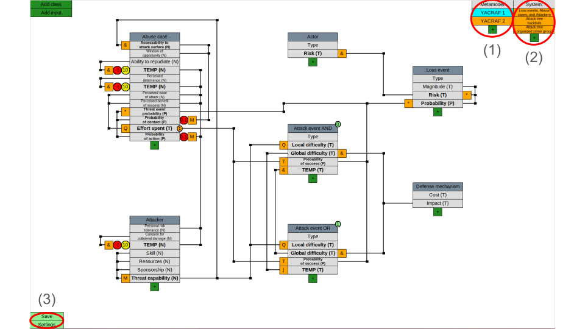
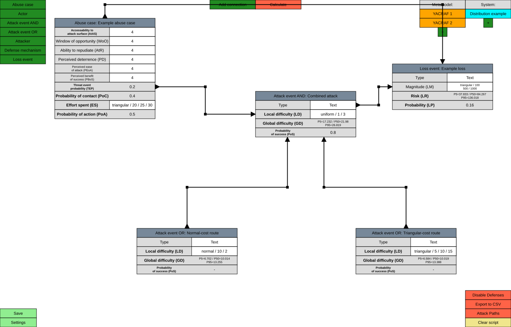
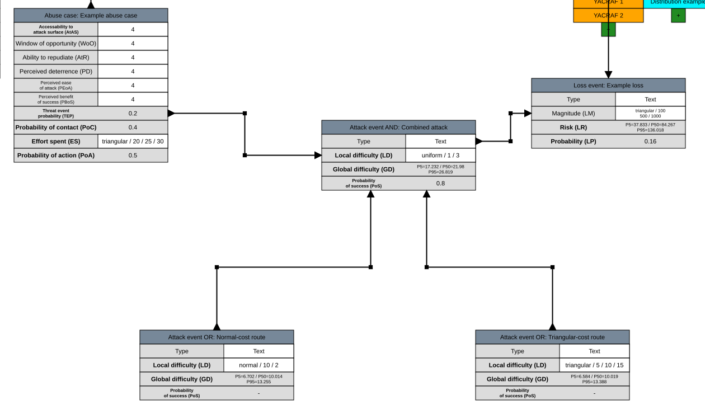
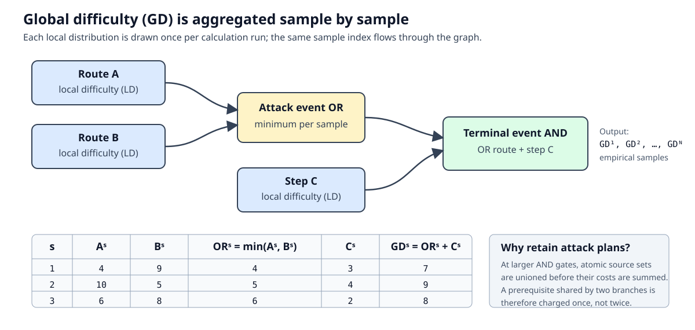
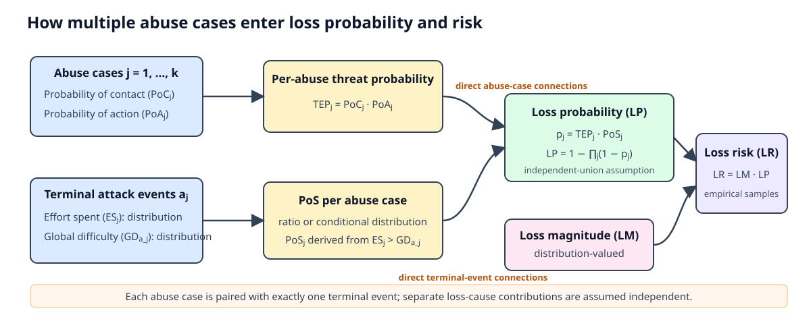
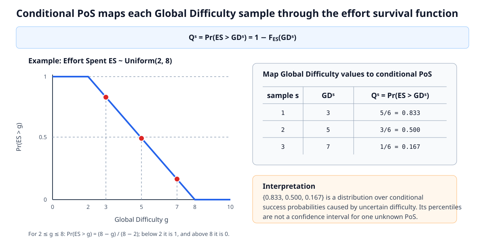
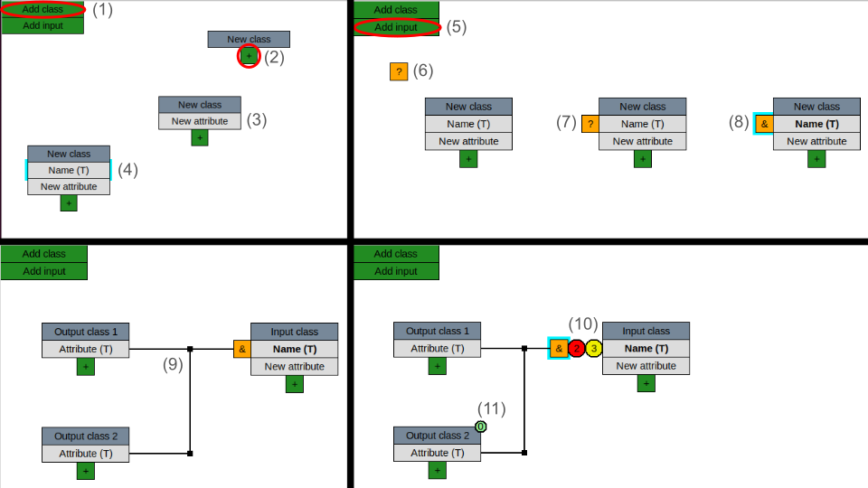
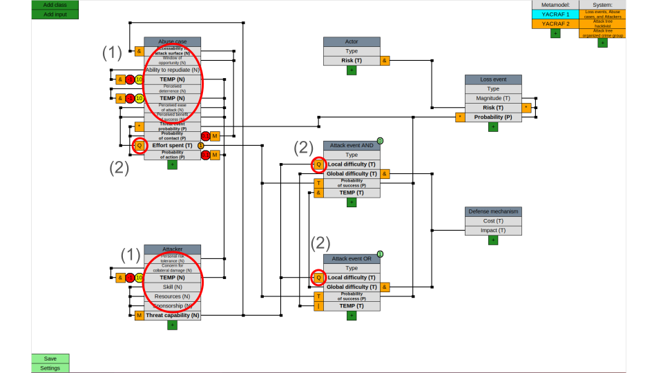

# YACRAF calculator

This is a graphical tool for doing calculations according to [Yacraf](https://link.springer.com/article/10.1007/s10207-023-00713-y) used in the KTH courses EP2790, EP2791, and EP279V.

This tool allows calculations inherent to the threat modeling to be set up and calculated using graphical block diagrams, where one can place, drag, and connect different blocks across various `Views`. The tool aims to allow for (i) the automation of the calculation process, where any changes to any block automatically propagate through the system and (ii) the simulation/analysis of various system configurations.

> **Use the bundled metamodel as-is.** It is the calculator's implementation of the YACRAF metamodel. Normal use consists of adding instances, values, and connections in `System Views`; changing the `Metamodel Views` is neither expected nor required. Metamodel editing is documented only for maintainers and advanced experiments in [Advanced: changing or rebuilding the YACRAF metamodel](#advanced-changing-or-rebuilding-the-yacraf-metamodel) at the end of this README. The optional `Conditional PoS distribution` mode is a calculator-level theoretical extension and is identified separately from the paper-compatible calculation below.

**Disclaimer**: The Yacraf calculator is prototype software. It was not developed as a commercial product fulfilling all the requirements that would come with that, but as a best-effort prototype for education and research. It is intended to assist practical use of Yacraf, but is by no means the only way to do Yacraf-based risk analysis. The code may contain bugs, so using it is at your own risk and all results need to be cross-checked. Known bugs are reported under Issues. Any help with improving any dimension of the tool is most welcome—looking forward to your pull request! :)

Having all that said, we hope you find the tool useful.

# Table of Contents

1. [Dependencies](#dependencies)
2. [Running the YACRAF Calculator](#running-the-yacraf-calculator)
3. [Features in this version](#features-in-this-version)
4. [GUI Overview](#gui-overview)
   - [View Switching](#views-switching)
   - [Working with System Views](#working-with-system-views)
     - [Adding Class Instances](#adding-class-instances)
     - [Adding Connections](#adding-connections)
     - [Calculating Values](#calculating-values)
5. [Distribution-valued calculations](#distribution-valued-calculations)
   - [Declaring input distributions](#declaring-input-distributions)
   - [Settings](#distribution-calculation-settings)
   - [Empirical Monte Carlo propagation](#empirical-monte-carlo-propagation)
   - [Global attack cost](#global-attack-cost)
   - [Probability and loss risk](#probability-and-loss-risk)
   - [Conditional PoS theoretical extension](#conditional-pos-distribution-a-theoretical-extension)
   - [Plotting distributions](#plotting-distributions)
6. [Scripts and Customization](#scripts-and-customization)
7. [Error Handling](#error-handling)
8. [Step-by-Step Video Walkthroughs](#step-by-step-video-walkthroughs)
9. [Reporting bugs with the YACRAF tool](#reporting-bugs-with-the-yacraf-tool)
10. [Contribute to YACRAF](#contribute-to-yacraf)
11. [FAQ](#faq)
12. [Advanced: changing or rebuilding the YACRAF metamodel](#advanced-changing-or-rebuilding-the-yacraf-metamodel)


## Dependencies

The program utilizes Tkinter for its GUI, NumPy for its calculations, and Matplotlib for distribution plots. If not already installed, Tkinter can on Debian-based Linux distributions (such as Ubuntu) be installed using:

```
sudo apt install python3-tk
```

The Python dependencies can be installed using:

```
pip install -r requirements.txt
```

Make sure the Python installation is not outdated. The known minimum requirement is Python 3.7, where 3.10 was used during the program's development. You may also need to update NumPy if you get an error related to it when booting the program.

## Running the YACRAF calculator

After navigating to the main directory, run the program using:

```
python3 main.py
```

This opens `example_distribution`, a small distribution-valued attack graph described below. To open or create a different save, specify its name:

```
python3 main.py <save_name>
```

Specifying a save name that does not currently exist creates a completely new save. To list the existing saves without opening the GUI, run `python3 main.py --list`.

The default saves of the program contain examples of the YACRAF metamodel, including accompanying system-model examples. The following default saves exist:

1. `example_distribution`: The default startup example. Two alternative attack events with `normal / 10 / 2` and `triangular / 5 / 10 / 15` local difficulty feed an AND event with `uniform / 1 / 3` local difficulty. An abuse case supplies `triangular / 20 / 25 / 30` effort, and the terminal event feeds a loss with `triangular / 100 / 500 / 1000` magnitude. The loss also receives the abuse case directly so its probability includes both threat-event probability and terminal PoS.
2. `example_single`: Example based on the illustrative example found in Section 4 of the YACRAF paper, where the YACRAF metamodel is defined in the corresponding `Metamodel Views`, and the calculations are performed in the `System Views`.
3. `example_triangle`: Same as `example_single`, except using triangle distributions whenever applicable.
4. `Cloud`: A small example of a threat model for a cloud service provider, adapted from this [example](https://www.nccgroup.com/research-blog/threat-modelling-cloud-platform-services-by-example-google-cloud-storage/) and represented using the YACRAF metamodel.
5. `custom`: Same `Metamodel Views` as `example_triangle`, but with blank `System Views` to simplify the creation of a new threat model for a different system using the YACRAF metamodel.

## Features in this version

This version retains the original scalar YACRAF workflow and adds distribution-valued analysis. The additions are summarized here and explained in detail later.

| Feature | What the end user can do |
| --- | --- |
| Named input distributions | Use uniform, triangular, non-negative normal, or lognormal distributions for local attack cost, abuse-case effort, loss magnitude, loss risk, and aggregated actor risk. |
| Empirical Monte Carlo propagation | Calculate every downstream distribution from samples of the declared inputs instead of forcing an analytically fitted output family. |
| Attack-plan-aware cost aggregation | Evaluate OR alternatives per sample, combine AND requirements, and count a shared prerequisite only once. |
| Configurable sample count | Choose the number of Monte Carlo samples in `Settings`. |
| Configurable result summaries | Display either `P0 / P50 / P100` or `P5 / P50 / P95` in calculated distribution fields. Long percentile text is fitted or wrapped inside its field. |
| Two attack-event PoS modes | Retain the paper-compatible scalar success ratio or opt into a distribution of success probabilities conditional on uncertain global cost. |
| Distribution-valued losses | Give loss magnitude a distribution and propagate scalar or distribution-valued probability into loss risk. |
| Full distribution plots | Plot an empirical density histogram and cumulative distribution for supported manual and calculated attributes, including abuse-case effort and attack-event PoS. |
| Default worked example | Start directly in `example_distribution`, a five-node example connecting an abuse case, alternative attack steps, a terminal step, and a loss event. |
| Compatibility and diagnostics | Load legacy three-number triangular values, avoid storing thousands of calculated samples in save files, and report invalid distribution/configuration inputs with calculation-specific warnings. |

The distribution features require NumPy for sampling and Matplotlib for plots. General settings are stored with the save and take effect on the next calculation.


## GUI Overview

The graphical interface contains `System Views` (`Setup Views`) for building the analyzed scenario and `Metamodel Views` (`Configuration Views`) containing the bundled YACRAF definition. End users normally work only in `System Views`: add an abuse case, attack events, loss events, and other instances; enter their values; connect them; and calculate. The metamodel views may be inspected to understand dependencies, but editing them is an advanced maintenance activity documented at the end of this README.


### Views Switching 

In the top right corner of the GUI are two columns of buttons - see (1) and (2) in the figure below. The figure shows a `Metamodel View`. These buttons switch between the different `Views`, where the left-most column switches between `Metamodel Views` and the right-most between `System Views`. The button with the `+` allows for an additional `View` to be added. The current `View` can be configured by pressing E (for edit) when no block inside the `View` is selected (will edit the block otherwise), whereas one for a `Metamodel View` can:

1. Change its name
2. Switch their button order
3. Delete it

For a `System View`, one can:

1. Change its name
2. Switch their button order
3. Create a copy of it
4. Temporarily exclude it from current calculations
5. Delete it

The save button in the bottom left corner ((3) in the below figure) saves the current state of all `Metamodel Views` and `System Views`, but also any changes to the general settings found by pressing the settings button. Any selected block within a `View` can be deleted by pressing backspace.



### Working with System Views

Shown in the figure below is an example of a `System View` reflecting the system that the metamodel from the corresponding `Metamodel Views` has been applied to. The buttons at (1) in the figure are used to create `Connections` between `Classes` and calculate the final values, respectively. (2) shows buttons for running custom scripts that can calculate/simulate different scenarios throughout the `System Views`. Scripts are explained in detail later.



#### Adding Class Instances

An instance of a `Class` from a `Metamodel View` can be added to the current `System View` by pressing the corresponding button in the top left corner, as shown by (1) in the `System View` in the below figure. The `Class` instances can be configured by pressing E when selected, where one can:

1. Change the name of the corresponding `Class` instance
2. Create a linked copy of the instance to another `System View` (any calculated value takes all linked versions into account), identified by a marker in their upper right corner (see (3) in the figure below)



#### Adding Connections

Pressing the add connection button at the top ((4) in the above figure) creates a directional `Connection` (see (5)) that can be attached to `Classes` (see (6)) by dragging its corresponding ends. The `Attributes` of the `Class` that the `Connection` points to may take input from the other `Class` if such `Attribute` relations have been configured in the `Metamodel Views`. Attaching a `Connection` to a `Class` will automatically disable `Attribute` entry fields if the corresponding value is dependent on at least one connected `Class`. By pressing E after selecting a corner on the directional `Connection`, one can:

1. Add a scalar that is applied to input values obtained through the `Connection`, where the appearing indicator (see (7)) can be dragged along the path of the `Connection`

#### Calculating Values

The calculate button at the top (see (8)) calculates the values of all `Attributes` that do not have a manual input entry field. Calculated are the `Attributes` of all `Classes` in all `System Views`. In the case of the above figure, the `Attribute` indicated by (9) has been calculated using the corresponding `Attribute` values of its input `Classes`. The input `Attributes` in question are highlighted when the `Attribute` is selected.

## Distribution-valued calculations

### Declaring input distributions

The sampled distribution value type `(D)` can represent local attacker cost, global attacker cost, attacker effort, loss magnitude, loss risk, and aggregated actor risk. A manual value starts with the distribution name followed by its parameters:

```text
uniform / minimum / maximum
triangular / minimum / mode / maximum
normal / mean / standard deviation
lognormal / median / geometric standard deviation
```

Examples are `uniform / 2 / 5`, `triangular / 2 / 3 / 5`, `normal / 4 / 1`, and `lognormal / 6 / 1.5`. All four represent non-negative quantities:

- `uniform` gives equal density between its minimum and maximum.
- `triangular` uses a minimum, most likely value (mode), and maximum.
- `normal` uses an arithmetic mean and standard deviation and is truncated at zero by rejection sampling.
- `lognormal` uses a median and geometric standard deviation; the geometric standard deviation must be at least 1.

Select a manually entered `(D)` attribute and press `E` to choose a template in the GUI. The inserted template remains editable. Legacy three-number inputs such as `2 / 3 / 5` are interpreted as triangular distributions, and bundled triangle-based saves are migrated on load for attack costs, abuse-case effort, loss magnitude, loss risk, and actor risk.

### Distribution calculation settings

Open `Settings` to configure:

1. **Number of samples**: the Monte Carlo sample count, with a minimum of one. More samples normally make quantiles and probability estimates more stable but take more time and memory.
2. **Distribution result percentiles**: either `P0 / P50 / P100` or `P5 / P50 / P95`. This changes the three values shown inside calculated `(D)` fields and the markers in distribution plots; it does not change the underlying samples. `P0` and `P100` are sample extremes and are consequently more sensitive to sample count than `P5` and `P95`.
3. **Attack-event PoS calculation**: `Single success ratio` or `Conditional PoS distribution`. The first is the paper-compatible scalar result. The second is the optional theoretical extension described below.

Settings apply when `Calculate` is next pressed and are persisted when the save is saved. Calculated sample arrays are not persisted: they are regenerated from the declared input distributions, keeping save files small. Two calculations can therefore differ slightly because they contain new random draws.

### Empirical Monte Carlo propagation

The named distributions describe the **inputs**. For each calculation run, the calculator draws $N$ values from every manual distribution:

$$
x_j^{(s)} \sim X_j, \qquad s=1,\ldots,N.
$$

It then evaluates the model for sample index $s$, producing $y^{(1)},\ldots,y^{(N)}$. This sample vector is the empirical output distribution. The calculator does not assume that the output is normal, triangular, or any other named family and does not fit such a family after aggregation. Displayed quantiles and plots are calculated directly from the empirical samples.

Different manual sources are sampled independently. When the same local attack step is reused through several graph branches or linked views, its samples are cached for that calculation run and reused consistently. Arithmetic involving a distribution and a scalar broadcasts the scalar across all $N$ samples; arithmetic involving distributions is performed on aligned sample indices.

### Global attack cost

For an atomic attack event $i$, let $L_i^{(s)}$ be its sampled local cost. A complete feasible attack plan $p$ is represented as a set of required atomic attack events, so its cost in sample $s$ is

$$
C_p^{(s)} = \sum_{i \in p} L_i^{(s)}.
$$

If $\mathcal{P}_a$ is the set of feasible plans that reach attack event $a$, the event's global cost sample is

$$
G_a^{(s)} = \min_{p \in \mathcal{P}_a} C_p^{(s)}.
$$

The GUI's gate operations construct these plans as follows:

1. `OR` collects the alternative input plans. The cheapest alternative may be different in different Monte Carlo samples.
2. `AND` forms every required combination and uses set union on the atomic events. A prerequisite shared by two branches is therefore charged once rather than twice.
3. Plans that are strict supersets of another feasible plan are discarded. This is valid because supported local costs are non-negative, so a strict superset cannot be cheaper.



The result at every attack step is therefore the empirical distribution of the cheapest complete plan reaching that step—not merely the sum or minimum of three displayed percentiles. For attack-cost calculations, keep metamodel input scalars at `1` and offsets at `0`. Applying an affine transform to an already aggregated plan is numerically supported, but it discards atomic plan provenance; later gates can then no longer remove duplicated shared prerequisites.

### Probability and loss risk

The bundled metamodel separates the probability that an attack is initiated from the probability that an initiated attack succeeds:

$$
P_{\text{threat}} = P_{\text{contact}} \cdot P_{\text{action}}.
$$

The abuse case's `Probability of action` therefore does **not** alter an attack event's PoS. PoS answers the conditional question “given the attacker's effort and this attack cost, can the attempted attack succeed?” The abuse-case probabilities enter when the terminal attack event is connected to a loss:

$$
P_{\text{loss}} = P_{\text{threat}} \cdot \operatorname{PoS}_{\text{terminal}},
\qquad
R_{\text{loss}} = M_{\text{loss}} \cdot P_{\text{loss}}.
$$



System-view connections are direct, not transitive. A loss event needs one incoming connection from the relevant abuse case, supplying `Threat event probability`, and one from the single terminal attack event, supplying PoS. Connecting the abuse case only to an attack event does not implicitly forward the threat-event probability to the loss. If PoS does not change but the loss probability also remains unchanged after changing `Probability of contact` or `Probability of action`, check this direct abuse-case-to-loss connection.

In `Single success ratio` mode, $P_{\text{loss}}$ is scalar. A distribution-valued magnitude still makes risk distribution-valued: $R_{\text{loss}}^{(s)}=M_{\text{loss}}^{(s)}P_{\text{loss}}$. In Conditional PoS mode, probability and risk remain distribution-valued:

$$
P_{\text{loss}}^{(s)}=P_{\text{threat}}Q^{(s)},
\qquad
R_{\text{loss}}^{(s)}=M_{\text{loss}}^{(s)}P_{\text{loss}}^{(s)}.
$$

The standard bundled scenario expects one terminal attack event per loss. The generic multiplication operation will multiply several PoS inputs if several terminal events are connected to one loss, which encodes an “all connected terminal events are required” assumption and should be used only deliberately.

### Single success ratio (paper-compatible mode)

Let $E^{(s)}$ be a sampled abuse-case effort value and $G_a^{(s)}$ the sampled global cost of attack event $a$. `Single success ratio` reports one scalar:

$$
\widehat{\operatorname{PoS}}_a
= \frac{1}{N}\sum_{s=1}^{N}
\mathbf{1}\!\left[E^{(s)} > G_a^{(s)}\right].
$$

Every aligned pair is one simulated attack situation. It contributes 1 when effort is strictly greater than cost and 0 otherwise. The result is the fraction of successful situations and estimates $\Pr(E>G_a)$. Equality counts as failure. This remains the default mode because it returns the single probability used by the original workflow.

### Conditional PoS distribution: a theoretical extension

> **Important theoretical status:** `Conditional PoS distribution` is an optional extension implemented by this calculator. It is not the single-value PoS calculation described in the YACRAF paper. Results produced in this mode should be labeled as conditional-PoS distributions and should record the mode and sample count used.

To use it, open `Settings`, select `Conditional PoS distribution`, and press `Calculate`. Then select an attack event's `Probability of success`, press `E`, and choose `Plot distribution` to inspect the result.

#### Motivation

The scalar ratio integrates over all uncertainty in global cost and returns one number. That is often exactly what is needed for expected risk, but it hides whether success is nearly constant or changes substantially between low-cost and high-cost realizations. Conditional mode retains this variation.

Let $F_E(g)=\Pr(E\leq g)$ be the cumulative distribution function of attacker effort and $S_E(g)=1-F_E(g)$ its survival function. For every sampled global cost $G_a^{(s)}=g_s$, conditional mode defines

$$
Q_a^{(s)} = \Pr(E>g_s) = S_E(g_s)=1-F_E(g_s).
$$

Because the implementation has effort samples rather than an analytic CDF, it uses the empirical survival function:

$$
Q_a^{(s)}
= \widehat S_E\!\left(G_a^{(s)}\right)
= \frac{1}{N}\sum_{t=1}^{N}
\mathbf{1}\!\left[E^{(t)} > G_a^{(s)}\right].
$$

The separate indices are important. For each cost sample $s$, the calculator compares that cost with **all** effort samples $t$. Sorting the effort samples makes this calculation efficient. The output $Q_a^{(1)},\ldots,Q_a^{(N)}$ is retained as an empirical probability distribution and can be summarized or plotted.



#### Interpretation and relation to the scalar result

| Mode | Returned object | Question answered |
| --- | --- | --- |
| `Single success ratio` | One number $\widehat{\Pr}(E>G_a)$ | Across all simulated effort-and-cost pairs, what fraction succeeds? |
| `Conditional PoS distribution` | Samples $Q_a^{(s)}$ in $[0,1]$ | How does the chance of success vary over plausible realized global costs? |

The conditional output is **not** a posterior distribution or confidence interval for one unknown PoS, and it is not a vector of Bernoulli success/failure outcomes. Its percentiles describe variation in $\Pr(E>g)$ caused by uncertain $g$. They do not quantify estimation confidence; increasing $N$ only makes the empirical approximation smoother and more stable.

Conditional mode treats effort $E$ and global cost $G_a$ as independent. Under this assumption,

$$
\mathbb{E}_{G_a}\!\left[\Pr(E>G_a\mid G_a)\right]
= \Pr(E>G_a),
$$

so the mean of the conditional-PoS samples should approach the scalar PoS as the sample count grows. Their medians and other percentiles need not equal the scalar probability. If effort and cost are dependent—for example, better-resourced attackers systematically choose harder routes—the correct quantity would require a joint model such as $\Pr(E>g\mid G_a=g)$. The current calculator does not model that dependence.

#### What the mapping looks like for each input distribution

The implementation always evaluates the empirical survival function, so it does not need these closed-form expressions. They clarify the theoretical mapping for a cost realization $g$:

- For $E\sim\operatorname{Uniform}(a,b)$, $Q(g)=1$ below $a$, $Q(g)=0$ at or above $b$, and

  $$
  Q(g)=\frac{b-g}{b-a}, \qquad a\leq g<b.
  $$

- For $E\sim\operatorname{Triangular}(a,m,b)$, where $m$ is the mode,

  $$
  Q(g)=
  \begin{cases}
  1, & g<a,\\
  1-\dfrac{(g-a)^2}{(b-a)(m-a)}, & a\leq g\leq m,\\
  \dfrac{(b-g)^2}{(b-a)(b-m)}, & m<g<b,\\
  0, & g\geq b.
  \end{cases}
  $$

  If the mode equals an endpoint or all three parameters are equal, interpret this expression by its corresponding limiting or deterministic case.

- For the calculator's zero-truncated normal $E\sim\operatorname{Normal}(\mu,\sigma^2)\mid E\geq0$, with standard normal CDF $\Phi$, $Q(g)=1$ for $g<0$, and for $g\geq0$,

  $$
  Q(g)=\frac{1-\Phi\!\left((g-\mu)/\sigma\right)}{1-\Phi\!\left(-\mu/\sigma\right)}.
  $$

  When $\sigma=0$, effort is deterministic and the mapping is a step at $\mu$.

- For $E\sim\operatorname{Lognormal}(\log m,\log^2 g_{\mathrm{sd}})$, where $m$ is the median and $g_{\mathrm{sd}}$ the geometric standard deviation, $Q(g)=1$ for $g\leq0$, and

  $$
  Q(g)=1-\Phi\!\left(\frac{\log g-\log m}{\log g_{\mathrm{sd}}}\right), \qquad g>0.
  $$

  When $g_{\mathrm{sd}}=1$, effort is deterministic at the median.

The strict comparison $E>g$ is used in every case. With continuous distributions equality has probability zero, but it matters for deterministic or repeated empirical values.

#### Appropriate use and reporting

Use `Single success ratio` when a single paper-compatible PoS is required. Use Conditional PoS when the variation of success probability across uncertain attack costs is itself useful for sensitivity analysis, communication, or downstream distribution-valued risk. Before interpreting either result, ensure effort and cost use compatible units, refer to the same attack opportunity and time horizon, and represent the intended attacker.

When reporting Conditional PoS, include:

- the effort distribution and all local-cost distributions;
- the Monte Carlo sample count;
- that the independence assumption was used;
- the selected displayed percentiles; and
- both the mean (for comparison with scalar PoS) and the plotted empirical distribution where practical.

### Plotting distributions

Select a supported distribution-valued attribute, press `E`, and choose `Plot distribution`. For calculated fields, press `Calculate` first. The plot window contains an empirical density histogram and the full empirical cumulative distribution function (CDF), with the selected result percentiles marked.

Plots are available for manual local attack costs, abuse-case effort spent, loss magnitudes, calculated global attack costs, Conditional PoS outputs, loss probability when distribution-valued, loss risk, and other supported distribution-valued attack/loss attributes. A plot shows all finite empirical samples, not only the three values displayed inside the block.

## Scripts and Customization

Scripts to visualize or analyze different scenarios, such as finding the most optimal order of implementing defense mechanisms or enumerating and visualizing the easiest attack paths, can be created using Python scripts that interface to the tool. Scripts are created and explained in detail in the `scripts` directory.
We provide three scripts: ``Attack_Paths.py``: marks, in a YACRAF view, the easiest previous attack step for a chosen attack event by scanning inputs and comparing global difficulty values. ``Disable_Defenses.py``: temporarily turns off all defense mechanisms by overriding their Impact values to zero, then recalculates outcome. ``Export to CSV.py``: exports YACRAF data for Loss events, Abuse cases, and Attackers to a CSV-style table (headers + rows) after recalculating values.

Note: Computationally heavy scripts could take some time to complete. The corresponding button will appear pressed (have changed color) while the script is running.

## Error Handling

Any errors found in the `Metamodel Views` or `System Views` upon calculating `Attribute` values are printed.

## Step-by-Step Video Walkthroughs 

We provide a set of short tutorial videos that walk you through the tool, from setup and basic navigation to running example workflows with YACRAF. Watch them in order for a quick onboarding. Links to each video are listed below

- Video 1 - [First launch & pre-installed models](https://play.kth.se/media/YACRAF-tool-1/0_of3nc0sc)
- Video 2 - [Workspace creation](https://play.kth.se/media/YACRAF-tool-2/0_mtn010dp)
- Video 3 - [Creating attacker profiles & abuse cases](https://play.kth.se/media/YACRAF-tool-3/0_mkt2fuhc)
- Video 4 - [Creating attack trees](https://play.kth.se/media/YACRAF-tool-4/0_yc4z3d9j)
- Video 5 - [Metamodel editing](https://play.kth.se/media/YACRAF-tool-5/0_wa27pt27)


## Reporting bugs with the YACRAF tool 
If you hit a bug while using the Yacraf calculator or examples, please open a **GitHub Issue** (preferred) or email us. **Before you file the issue**, please update to the **latest commit/release** and try again, and check **existing issues** to avoid duplicates.


## Contribute to YACRAF

Improvements are welcome: refactoring, scripts, docs, examples, you name it. Fork the repo, make your changes, and open a pull request with a short description.

## FAQ 
#### Q1: What exactly does the YACRAF Calculator calculate?

**A1:** The YACRAF Calculator performs automated cyber risk assessments based on the YACRAF framework. It uses block diagrams to represent a metamodel of threats, system attributes, and relationships. The tool calculates how changes in attributes (such as attack likelihood or impact) propagate through the system, generating risk scores or other evaluation metrics.


#### Q2: How is the YACRAF Calculator structured?

**A2:** The YACRAF Calculator is structured around two view types: **Metamodel Views** and **System Views**. The shipped Metamodel Views implement the YACRAF classes, attributes, and relations. System Views apply that fixed definition to a concrete scenario by adding instances, values, and connections. Normal end-user work takes place in System Views.


#### Q3: Should I modify the metamodel provided in the custom example?

**A3:** No. The provided metamodel is the calculator's implementation of YACRAF and should normally remain unchanged. Editing it can invalidate examples, calculations, and scripts. Only maintainers or researchers deliberately experimenting with a different metamodel should use the advanced instructions at the end of this README.


#### Q4: Can YACRAF handle multiple System Views for the same Metamodel?

**A4:** Yes, YACRAF allows multiple System Views for the same Metamodel. You can create different system setups, such as modeling a DDoS attack in one view and a phishing attack in another, all while using the same underlying Metamodel.


#### Q5: What resources are provided, and which should I use?

**A5:** We provide some System Views to help you get started:  

- **example_single:** Based on Section 4 of the YACRAF paper.  

- **example_triangle:** Similar to `example_single` but with triangle distributions.  

- **example_distribution:** The default five-node distribution example, containing an abuse case, two alternative attack routes, a combined attack event, and a loss event.

- **custom:** Blank System Views with the YACRAF metamodel for creating your own models.  

We recommend using the custom save to design your own threat models.


#### Q6: How do I edit or delete blocks and Views?

**A6:**  

- **Edit a block or View:** Select it and press `E`.  

- **Delete a block:** Select it and press the `Backspace` key.  

- **Delete a View:** Edit the View (press `E` when no block is selected) and choose the delete option.


#### Q7: How do I create and use connections between classes and attributes?

**A7:** Connections between attributes or classes are made by right-clicking an attribute and then clicking on the destination block. These connections define the flow of information or dependencies between different blocks, such as linking the cost of one attack to another attack’s likelihood. You can further configure these connections, making them external or modifying the flow based on the system’s needs.


#### Q8: What mathematical operations are available for calculations?

**A8:** The YACRAF Calculator supports operations like AND/OR gates, multiplication, addition, and custom scalars or offsets. These can be defined within Input blocks to control how attributes interact.


#### Q9: What does setting a Connection as "external" do?

**A9:** An external Connection links Attributes only to other Class instances, excluding internal Attributes. It is indicated by a dashed line in the Metamodel View.


#### Q10: How do I create linked copies of Class instances?

**A10:** When editing a Class or Class instance (press `E`), choose the option to create a linked copy. Linked copies share calculations and are identified by a unique marker in the upper-right corner.


#### Q11: How do scalars and offsets work in Input blocks and Connections?

**A11:**  

- **Scalars:** Multiply the input value by a specified factor.  

- **Offsets:** Add a specified value after scaling.  

- **Setting Scalars/Offsets:** Edit the Input block or Connection (select and press `E`) and enter the desired values.


#### Q12: How does the tool ensure consistency between metamodel and system views?

**A12:** Consistency is maintained by linking the metamodel and system views. Any changes made to the Metamodel Views are automatically reflected in the corresponding System Views. This ensures that changes in the underlying structure, such as attribute definitions or class relationships, are consistent across all system-specific simulations.


#### Q13: What happens if I delete a class or attribute from a view?

**A13:** When you delete a class or attribute, all connections and relationships associated with that block are also removed. Any calculations that relied on the deleted components will need to be re-evaluated based on the new model structure.


#### Q14: How do I handle errors during calculations?

**A14:** Errors are displayed in the console when calculations are performed. Ensure all required inputs and Connections are correctly configured. Check for any missing dependencies or outdated packages.


#### Q15: How do I save my work?

**A15:** Click the "Save" button located at the bottom-left corner of the GUI. This saves all current Metamodel Views, System Views, and general settings.


#### Q16: How are Views organized within a save?

**A16:** Within each save directory:  

- **configuration directory:** Contains Metamodel Views.  

- **setup directory:** Contains System Views.  

- **view_file_paths.txt:** Specifies the paths and order of active Views.


#### Q17: What happens if I delete a View from within the GUI? Can it be recovered?

**A17:** If a View is deleted from within the GUI, it is not permanently removed from the save directory unless another View with the same name overwrites it. The deleted View will remain in the corresponding folder, allowing you to recover it later if necessary. This ensures that accidentally deleted Views can be restored without data loss.


#### Q18: How do I recover a deleted View?

**A18:** To recover a deleted View, navigate to the save directory and check the configuration or setup directories for the file corresponding to the deleted View. You can manually restore it by referencing its file or re-adding it to the `view_file_paths.txt` if needed.


#### Q19: Can I rename or move save directories?

**A19:** While it’s technically possible to rename or move save directories outside of the GUI, doing so manually might cause inconsistencies in how the views are referenced within the `view_file_paths.txt`. It’s recommended to handle any save-related actions (like renaming or deleting) within the GUI to maintain proper references between files.


#### Q20: What if I want to create a backup of my saves?

**A20:** To back up your saves, you can simply copy the entire save directory to another location. Since each save is self-contained within its directory (including both the configuration and setup views), copying this folder ensures that all related files, including the `view_file_paths.txt`, are preserved.


#### Q21: What are scripts in the YACRAF Calculator?

**A21:** Scripts are Python files used to automate tasks, run simulations, or analyze scenarios within the tool. They interact with the model and system configurations.


#### Q22: What scripts are available?

**A22:** The available scripts include:

 - ``Attack_Paths.py``: marks, in a YACRAF view, the easiest previous attack step for a chosen attack event by scanning inputs and comparing global difficulty values.
 - ``Disable_Defenses.py``: temporarily turns off all defense mechanisms by overriding their Impact values to zero, then recalculates outcome.
 - ``Export to CSV.py``: exports YACRAF data for Loss events, Abuse cases, and Attackers to a CSV-style table (headers + rows) after recalculating values.


#### Q23: Can I add more scripts?

**A23:** Yes, while we don’t require you to add scripts for the project, you are free to create them if needed. To add a script, copy and modify the `SCRIPT_TEMPLATE.py` file. The new script will appear in the GUI for activation.


#### Q24: How do I activate scripts in the YACRAF calculator?

**A24:** Once the calculator is running, a button for each script will appear in the bottom right corner of the System Views. You can click the button to execute the script and see the results within the interface.

## Advanced: changing or rebuilding the YACRAF metamodel

> **This section is not part of the normal modeling workflow.** The bundled Metamodel Views encode the YACRAF metamodel and are expected to remain unchanged. Create scenarios in System Views instead. A metamodel change can alter the meaning and value type of existing attributes, break saved examples, and invalidate assumptions made by scripts. Make such a change only when intentionally maintaining the tool or researching a different metamodel, and work on a copy of the save.

The selectable distribution settings and Conditional PoS mode described above do not require an end user to modify the metamodel. They are implemented by the calculator and the metamodel already bundled with this branch.

### Working with Metamodel Views

`Metamodel Views` (`Configuration Views`) define the classes available in System Views and the dependencies between their attributes. For example, they define an attack-event class, its local and global cost attributes, and which connected attributes provide calculation inputs. Changes propagate to all System Views belonging to the save.


### Creating classes and attributes

A new metamodel `Class` is created with the add-class button in the top left, illustrated by (1) below. Button (2) adds an `Attribute` to the class, producing (3). Select an attribute, as at (4), and press `E` to configure:

1. its name;
2. its displayed order in the class;
3. its value type, such as a number, probability, legacy triangle distribution, or sampled distribution (identified by `(D)`); and
4. whether it is hidden from System Views, which is useful for intermediate calculation attributes.

Select the class and press `E` to change its name or create a linked copy in another Metamodel View. Linked copies represent the same class across views and carry a shared identifier in the upper-right corner, shown at (11).



### Adding calculation inputs

The add-input button, shown at (5), creates an `Input` block such as (6). Drag the input next to its destination attribute, as at (7). Select it and press `E` to configure:

1. the mathematical operation, including mean, AND/addition, OR/minimum, multiplication, division, effort-versus-cost comparison, or qualitative input;
2. a scalar applied to the calculated input, shown as 2 at (10); and
3. an offset added after scaling, shown as 3 at (10).

Connect an attribute to the `Input` block by right-clicking the source attribute and then left- or right-clicking the input, as at (9). Operations such as division and effort-versus-cost comparison require a specific number and order of inputs; their connections are numbered automatically in creation order.

### Metamodel attribute connections

Select a connection corner and press `E` to mark the connection as external. An external connection, drawn dashed, accepts an attribute only from another class instance and ignores an internally connected attribute. This is how an attack event can consume the global cost of preceding attack-event instances without also consuming its own global cost. Connection corners can be dragged to improve the diagram layout.

### How the included YACRAF metamodel is implemented

The attributes highlighted by (1) below accept an input between 0 and 10. The shown sequence of AND/addition, multiplication by 0.1, and offset 10 feeds a temporary hidden attribute and converts a negatively formulated scale to a positively formulated one, or vice versa. For example, it transforms 3 into $10-3=7$.

Calculation type `Q`, shown at (2), represents a qualitative relationship. It performs no numerical operation and leaves the corresponding value for manual input; its connections visually identify the relationship and highlight relevant inputs.


